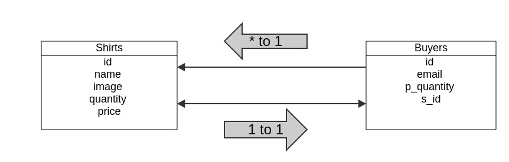

### sweatshop.ly
a t-shirt shopping site

## Created by

- Tom Shea (<a href='https://github.com/TShea124'>https://github.com/TShea124</a>)
- Julie Kwok (<a href='https://github.com/kwokster10/'>https://github.com/kwokster10/</a>)
- John Costanza (<a href='https://github.com/JC689'>https://github.com/JC689</a>)
- Eric Moskowitz (<a href='https://github.com/3moz'>https://github.com/3moz</a>)

## Technology Used

- Sinatra
- SQLite3
- ActiveRecord

## Entity Relationships:



## Functionality

#User
- User can 'buy' a quantity of a given shirt if at least that quantity exists in inventory
- In a tranaction, a user chooses quantity to purchase and enters an email address
- Available inventory updates to reflect quantities purchased by a user
- User sees a confirmation when they make a purchase.

#Admin
- Admin can go to ```/admin``` and see an admin panel.
- Admin can add a shirt, remove a shirt, and update all the attributes of a shirt (quantity, price, image url)
- Admin can see all past purchases of a given customer.


